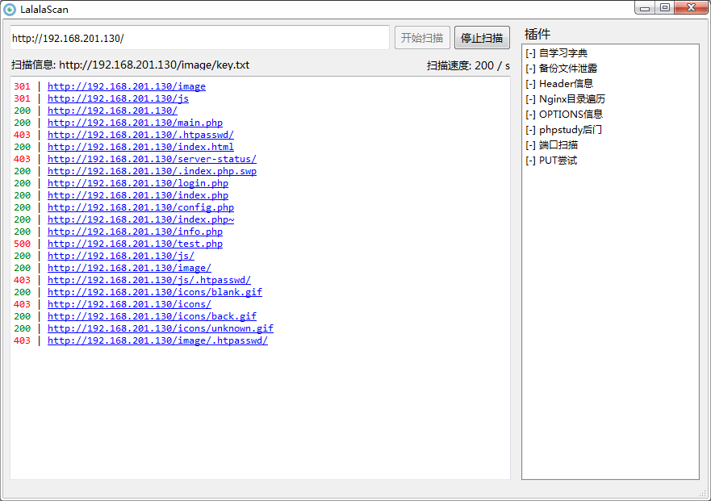
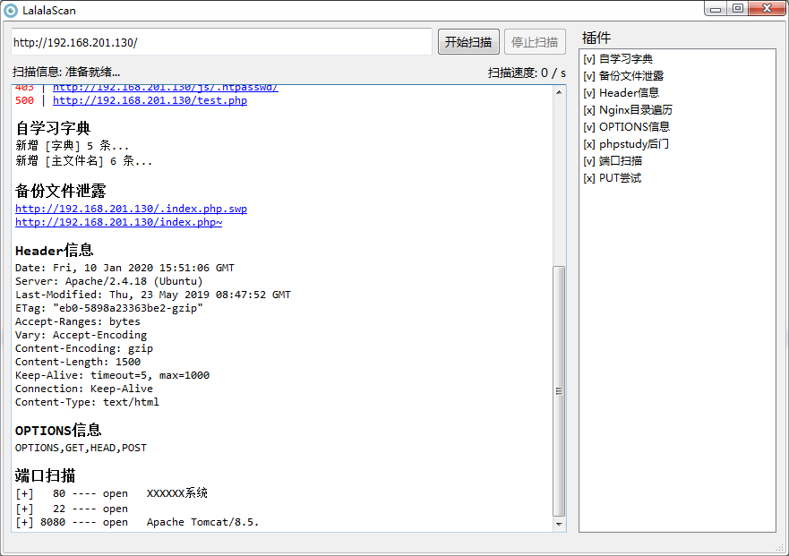

# LalalaScan

一个拥有图形界面的web目录扫描工具，能够灵活加载插件





一直在用御剑进行扫描，感觉太依赖字典了，也不够灵活。期间也找了些很厉害的命令行工具，但我还是习惯用鼠标点一点，最终决定自己写一个图形化的工具。


# 功能特点

1. 支持图形界面和简单的操作方式
2. 支持自动判断扩展名，例如:php/jsp/aspx...
3. **点击链接调用默认浏览器访问**
4. 支持协程并发扫描
5. 支持递归扫描，扫描到文件夹后继续深入扫描
6. 支持爬虫动态扫描，分析扫描页面中的链接后继续深入扫描
7. 支持自定义插件，目前已开发部分插件：
   - 自学习扫描结果，并保存到字典中
   - 备份文件泄露
   - Header信息获取
   - Nginx不安全配置导致的目录遍历
   - phpstudy后门
   - 常用端口和banner扫描
   - PUT Method尝试
   - ...


# 使用方法

## 1、windows可执行文件

已经打包好windows下可用的exe文件，在win7下测试可用，但还是建议使用源码防止出错。

下载地址：[LalalaScan_win64](https://github.com/chifanqu/LalalaScan/releases) 

解压后运行：`LalalaScan.exe`


## 2、源码安装

### 环境准备

```shell
git clone https://github.com/chifanqu/LalalaScan.git && cd LalalaScan && python3 -m pip install -r requirement.txt
```

### 开启

```shell
python3 StartLalalaScaner.pyw
```


# 插件介绍

所有python3插件放置在`plugin`文件夹中，支持启动自动加载`py`插件。在扫描完成后会将扫描结果传递给插件，并调用插件的`exploit`方法。插件需支持：

- **getName**方法，返回显示的插件名称
- **exploit**方法，进行自定义扫描，并返回list结果用于显示

### 一个简单的插件demo

```python
#!/usr/bin/env python3
# -*- coding: utf-8 -*-

def getName():
    '''
    @description: 插件名称
    @param: None
    @return: 插件名称
    '''
    return u"这里填写插件名称"

def exploit(oriTarget, scanResultAndResponseList):
    '''
    @description: 插件执行扫描
    @param: oriTarget - 输入框的原始输入
    @param: scanResultAndResponseList - 扫描结果的url和response(requests结果)
    @return: list() - 每个一行，支持HTML
    '''
    htmlList = []
    for scanResultAndResponse in scanResultAndResponseList:
        target   = scanResultAndResponse['target']
        response = scanResultAndResponse['response']
        htmlList.append(u"%s | %s" % (target, response.status_code))
    return htmlList
```


# 默认字典文件

所有字典均存放在`data`文件夹中

1. dict_mult文件夹，存放单个字典
2. dir_mult文件夹，存放目录字典
3. fuzz_mode_file文件夹，存放主文件名字典
4. fuzz_mode_ext.txt，存放扩展名字典


# TODO

- [ ] 打包可执行文件
  - [x] windows
  - [ ] Linux
  - [ ] OSX
- [ ] 路径扫描功能
  - [ ] 图形化界面配置参数
  - [ ] robots.txt解析

- [ ] 日志记录
  - [ ] 扫描日志
  - [ ] 错误日志
- [ ] 插件功能
  - [ ] 插件市场
  - [ ] 插件输出MarkDown
  - [ ] 类xray插件格式
  - [ ] struts2漏洞扫描
  - [ ] ...
- [ ] 自动更新


# 维护工作

1. 若使用过程中出现问题，欢迎发issue
2. 本项目将继续维护，包括但不限于扫描功能完善、新插件开发等，具体参照`TODO`列表
3. 欢迎提供各位大佬们提供插件思路 or 贡献插件


# 致谢声明

LalalaScan在编写过程中，借鉴了大量的优秀开源项目，特此说明并表示感谢。

- [dirmap](https://github.com/H4ckForJob/dirmap/blob/master/README_EN.md)
- [weakfilescan](https://github.com/ring04h/weakfilescan)
- [FileSensor](https://github.com/Xyntax/FileSensor)
- [qutebrowser](https://github.com/qutebrowser/qutebrowser/tree/master/qutebrowser)


# 联系作者

mail: yiyiyaya1@139.com

